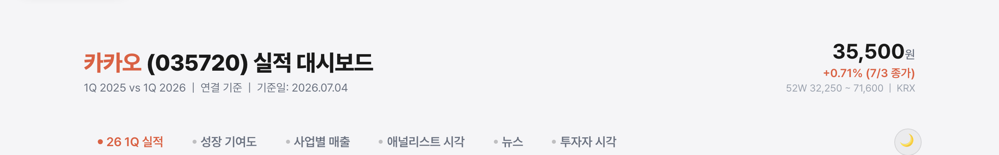
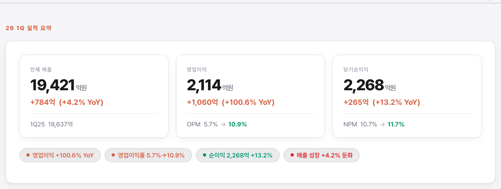
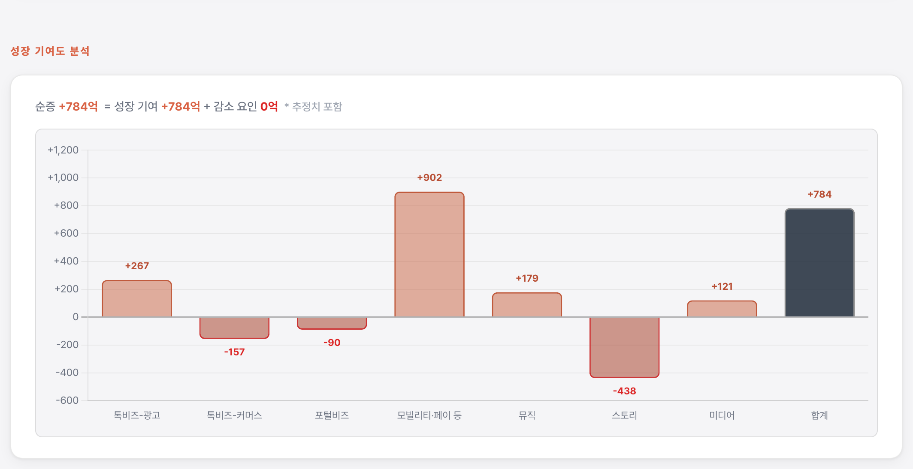
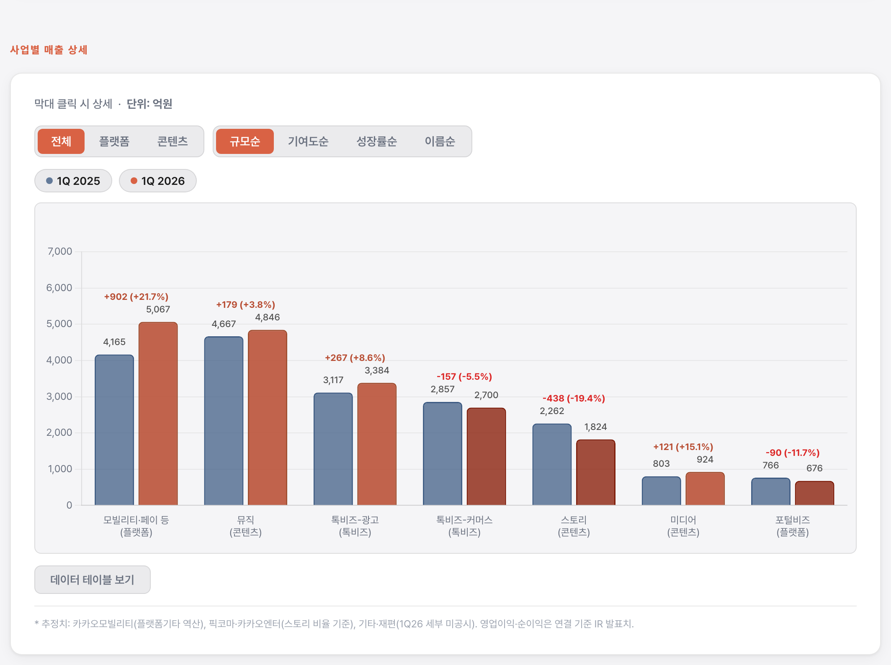
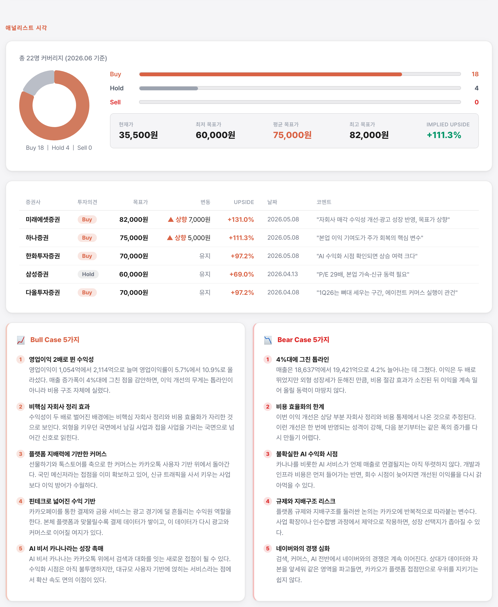
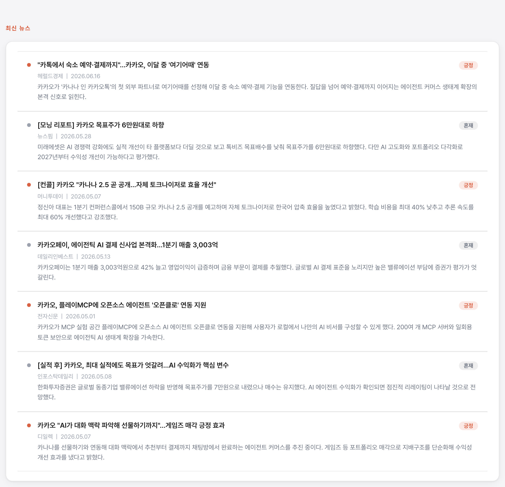
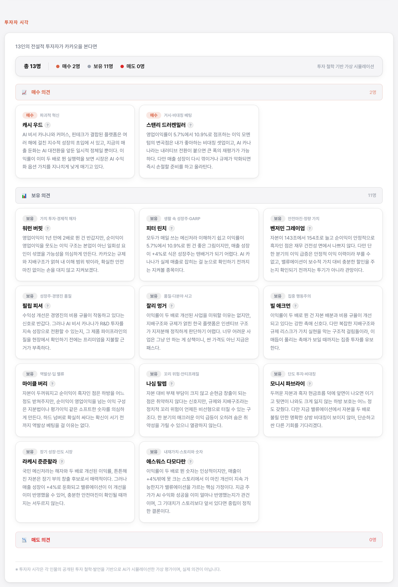

# dart

> DART 공시 데이터로 인터랙티브 애널리스트 HTML 리포트를 자동 생성하는 Claude Code 스킬

[](LICENSE)

---

## 개요

`/dart 카카오` 한 줄이면 끝납니다.

DART Open API에서 재무제표·공시 데이터를 수집하고, 13인 전설적 투자자의 철학으로 기업을 평가한 인터랙티브 HTML 리포트를 생성합니다. 라이트/다크 테마, Chart.js 차트, Pretendard 폰트가 기본 포함됩니다.

**예시** → [카카오 1Q2026 리포트 열어보기](https://airoasting.github.io/dart/%EC%B9%B4%EC%B9%B4%EC%98%A4_20260704.html)  ·  [SK하이닉스 (큰 숫자 사례)](https://airoasting.github.io/dart/SK%ED%95%98%EC%9D%B4%EB%8B%89%EC%8A%A4_20260704.html)

---

## 작동 방식

LLM이 HTML을 통째로 쓰지 않습니다. 보일러플레이트(CSS·차트·레이아웃)는 `assets/template.html`에 고정돼 있고, 스킬은 **데이터(`data.json`)만 만들어** `assets/build_report.py`로 결합합니다. 리포트 한 건이 몇 분이면 끝납니다.

- **재무** — DART Open API 연결 재무제표 (전년 동기 비교)
- **주가** — KRX 전일 종가·52주 범위 (`assets/price.py`, 웹 검색보다 정확)
- **뉴스·애널리스트·사업부문·페르소나·강세약세** — 서브에이전트로 병렬 수집·생성
- **기준일** — 리포트 생성일(실행일)로 자동 기록
- **차트 축** — 데이터에 맞춰 자동 스케일 (하드코딩 없음)

---

## 빠른 시작

### 1. 스킬 설치

```bash
# Claude Code 전역 스킬 디렉터리에 클론
git clone https://github.com/airoasting/dart ~/.claude/skills/dart
```

### 2. DART API 키 발급

[DART Open API](https://opendart.fss.or.kr) 에서 무료 발급 후 프로젝트 루트 `.env`에 추가:

```env
DART_API_KEY=your_key_here
```

### 3. Python 패키지 설치

```bash
pip install requests pandas
```

### 4. 실행

```
/dart 카카오
/dart SK하이닉스 1Q2026
실적 리포트 만들어줘 — 네이버
```

출력 파일은 자동으로 번호가 매겨집니다:

```
output/카카오_20260704_01.html
output/카카오_20260704_02.html   ← 같은 날 재실행 시
```

---

## 리포트 구성

| 섹션 | 내용 |
|------|------|
| **KPI 카드** | 매출액 · 영업이익 · 순이익 (YoY % 배지 + 인사이트 칩) |
| **성장 기여도** | 전기 대비 증감 waterfall |
| **사업별 매출** | 세그먼트별 바 차트 + 드릴다운 |
| **애널리스트 시각** | 컨센서스 도넛 · 목표주가 · Bull / Bear 근거 |
| **관련 뉴스** | 실적 발표 전후 2주 국내 신문사 기사 6~8건 (긍/부정/혼재 분류) |
| **투자자 시각** | 13인 투자자 페르소나 평가 |

---

## 예시 — 카카오 1Q2026

> `/dart 카카오` 실행 결과. 영업이익이 1년 만에 2배로 뛴 수익성 개선 분기입니다.

🔗 **[리포트 열어보기](https://airoasting.github.io/dart/%EC%B9%B4%EC%B9%B4%EC%98%A4_20260704.html)**

| 지표 | 2025 1Q | 2026 1Q | YoY |
|------|---------|---------|-----|
| 매출 | 18,637억 | **19,421억** | +4.2% |
| 영업이익 | 1,054억 (OPM 5.7%) | **2,114억 (OPM 10.9%)** | +100.6% |
| 당기순이익 | 2,003억 | **2,268억** | +13.2% |

재무는 DART 공시 그대로, 주가는 KRX 전일 종가, 사업부문 매출은 공개 성장률로 역산한 추정치입니다. 아래는 리포트 각 섹션 캡처입니다.

### 대시보드 헤더



### KPI 카드



### 성장 기여도 분석



### 사업별 매출 상세



### 애널리스트 시각



### 관련 뉴스



### 투자자 시각



> 큰 숫자 사례가 궁금하면 [SK하이닉스 1Q2026 리포트](https://airoasting.github.io/dart/SK%ED%95%98%EC%9D%B4%EB%8B%89%EC%8A%A4_20260704.html)(분기 매출 52조·영업이익률 71.5%)도 열어볼 수 있습니다. 극단적으로 큰 값에서도 차트 축이 데이터에 맞춰 자동 스케일됩니다.

---

## 투자자 페르소나

`investor_persona/`에 13인의 투자자 철학 파일이 있습니다. 각 파일은 **Overview → Core Principles → Required Analysis Sequence → Decision Rules → Risk and Uncertainty Rules → Anti-Hallucination Rules** 구조로, 그 투자자의 원칙·판단 절차와 지어내지 않기 위한 규칙을 담습니다. 스킬은 이 13개를 합친 통합본 `investor_persona/_ALL.md` 한 파일을 읽어 적용합니다.

rating(매수·보유·매도)은 고정이 아닙니다. 각 투자자의 Decision Rules를 실제 기업 데이터에 적용해 동적으로 결정됩니다.

피터 린치 · 캐시 우드 · 마이클 버리 · 스탠리 드러켄밀러 · 라케시 중주왈라 · 워런 버핏 · 찰리 멍거 · 필립 피셔 · 빌 애크먼 · 애스워스 다모다란 · 모니시 파브라이 · 벤저민 그레이엄 · 나심 탈렙

---

## 폴더 구조

```
~/.claude/skills/dart/
├── SKILL.md                       # 스킬 정의 — 동작 순서 · 데이터 가이드 · 규칙
├── README.md
├── LICENSE
│
├── 카카오_20260704.html            # 출력 예시 (대표)
├── SK하이닉스_20260704.html        # 출력 예시 (큰 숫자 사례)
├── kakao_20260510.html            # 초기 ground-truth
│
├── references/                    # 사람용 설계 문서 (런타임에 안 읽음)
│   ├── dart-api.md                # DART API 엔드포인트 · 보고서 코드
│   ├── design-system.md           # CSS 설계 (template.html에 반영됨)
│   └── section-templates.md       # HTML/JS 설계 (template.html에 반영됨)
│
├── assets/
│   ├── template.html              # 고정 보일러플레이트 템플릿
│   ├── build_report.py            # data.json + template → HTML 빌더
│   ├── data.example.json          # 데이터 계약(스키마) + 카카오 예시
│   ├── dart_client.py             # DART Open API 클라이언트
│   ├── price.py                   # 전일 종가·52주 (KRX)
│   ├── corp_codes_listed.csv      # 상장사 3,963개 corp_code (오프라인 검색)
│   └── screenshots/               # README 예시 이미지
│
└── investor_persona/              # 13인 투자자 철학 파일 (_ALL.md 통합본 포함)
    ├── peter_lynch.md
    ├── cathie_wood.md
    ├── michael_burry.md
    ├── stanley_druckenmiller.md
    ├── rakesh_jhunjhunwala.md
    ├── warren_buffett.md
    ├── charlie_munger.md
    ├── philip_fisher.md
    ├── bill_ackman.md
    ├── aswath_damodaran.md
    ├── mohnish_pabrai.md
    ├── benjamin_graham.md
    └── nassim_taleb.md
```

---

## corp_codes 갱신

상장사 코드는 DART에서 수시로 업데이트됩니다. 최신 목록이 필요할 때:

```python
from dart_client import DartClient
client = DartClient()
client._build_corp_codes_csv('assets/corp_codes_listed.csv')
```

---

## 라이선스

[MIT](LICENSE) © airoasting

---

## 면책 고지

이 스킬이 생성하는 리포트는 공개 공시 데이터를 기반으로 한 참고 자료입니다. 투자 권유가 아니며, 최종 투자 판단과 그에 따른 손익 책임은 전적으로 투자자 본인에게 있습니다. 투자자 페르소나 섹션은 각 인물의 공개된 철학을 AI가 시뮬레이션한 가상 평가이며, 실제 의견이 아닙니다.
