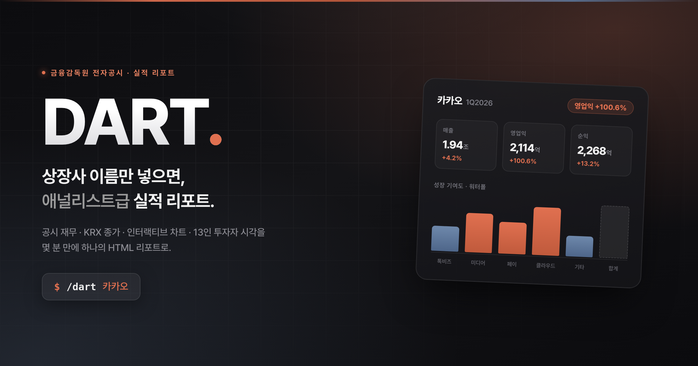
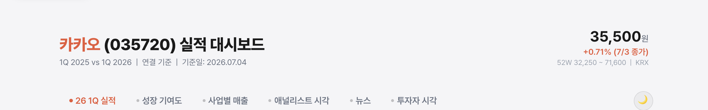
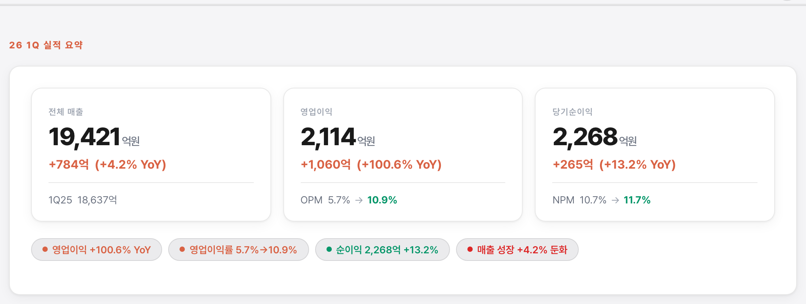
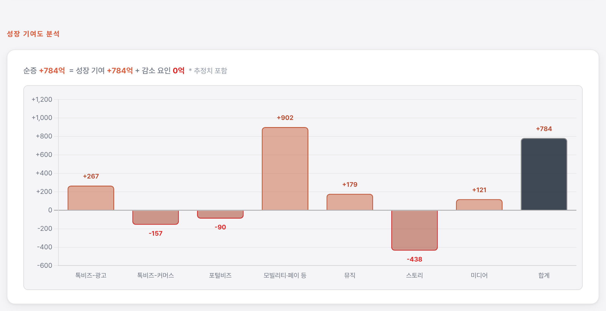
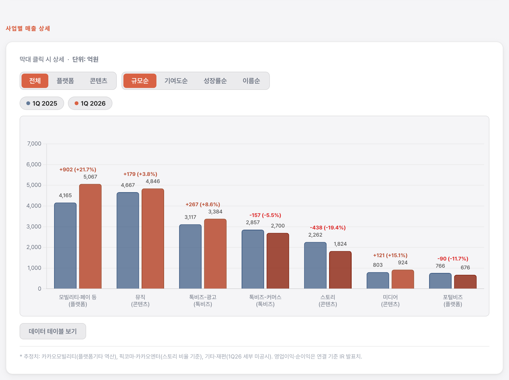
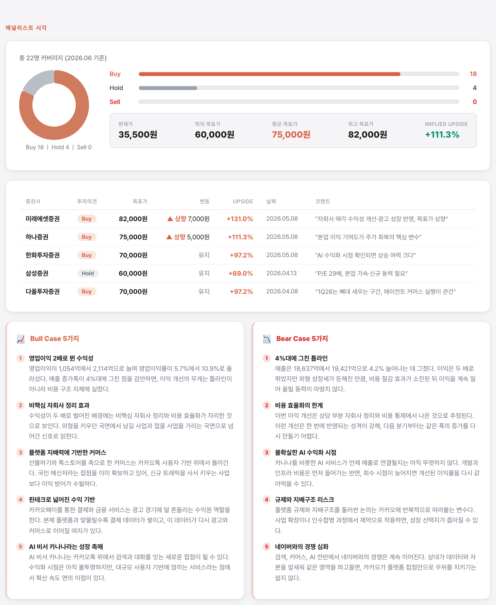
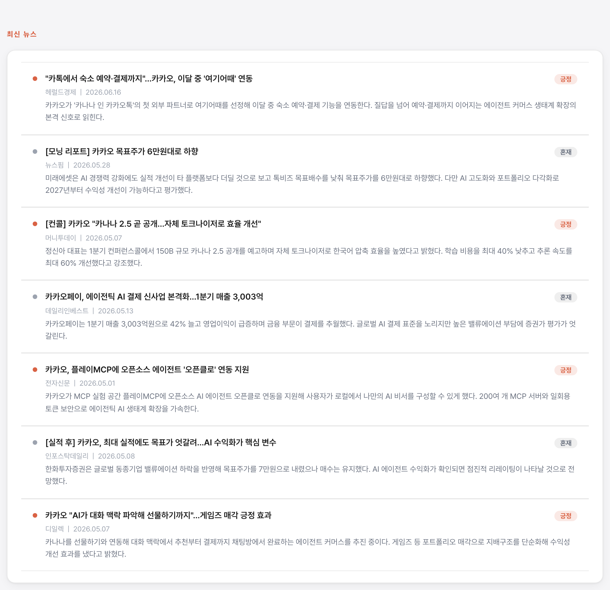
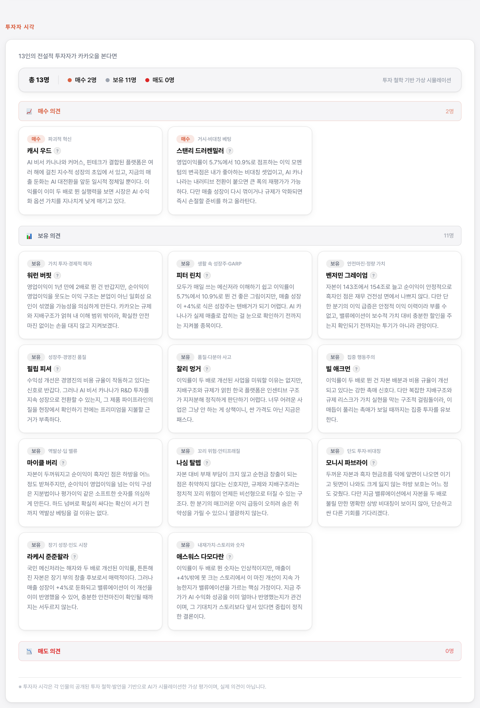

# dart



> 상장사 이름만 넣으면, 금융감독원 공시 데이터로 만든 애널리스트급 실적 리포트가 몇 분 만에 나옵니다.

[](LICENSE)

**바로 보기** → [카카오 1Q2026 리포트](https://airoasting.github.io/dart/%EC%B9%B4%EC%B9%B4%EC%98%A4_20260704.html)  ·  [SK하이닉스 2Q2026 (큰 숫자 사례)](https://airoasting.github.io/dart/SK%ED%95%98%EC%9D%B4%EB%8B%89%EC%8A%A4_20261004.html)

---

## 누가 쓰면 좋은가

- 종목의 실적을 빠르게 한눈에 파악하고 싶은 경영자와 투자자
- 증권사 리포트를 기다리기 전에 직접 먼저 훑어보고 싶은 분
- 코딩을 몰라도 됩니다. 한 줄이면 리포트가 만들어집니다.

## 무엇을 만들어 주나

`/dart 카카오`라고 부르면, 아래 7개 섹션이 담긴 인터랙티브 HTML 리포트가 만들어집니다. 라이트와 다크 테마, 차트가 기본으로 들어갑니다.

| 섹션 | 무엇을 보여주나 |
|------|------|
| **핵심 실적** | 매출, 영업이익, 순이익을 전년 동기와 비교합니다 |
| **성장 기여도** | 무엇이 실적을 끌어올렸는지 워터폴 차트로 보여줍니다 |
| **사업별 매출** | 부문별로 비교하고, 막대를 클릭하면 상세가 열립니다 |
| **애널리스트 시각** | 증권사 목표주가와 컨센서스, 강세와 약세 근거를 정리합니다 |
| **관련 뉴스** | 최신 국내 기사를 긍정, 부정, 혼재로 분류해 보여줍니다 |
| **투자자 시각** | 13인의 전설적 투자자가 이 종목을 본다면 어떻게 평가할지 담습니다 |
| **전문가 평가** | 맨 아래에 RED(논리), SILVER(분야 전문가), GOLD(실제 독자) 세 관점이 리포트 자체를 10점 만점으로 평가하고 고칠 점을 남깁니다. 참고용입니다 |

리포트까지 필요 없고 "카카오 최대주주 지분율", "삼성전자 직원 평균 급여"처럼 숫자 몇 개만 궁금하면 그냥 그렇게 물으면 됩니다. 스킬이 리포트 대신 [DART 도구 16개](#mcp-도구로-쓰기)로 바로 찾아, 어느 보고서 기준인지와 공시 원문 링크를 붙여 답합니다.

## 믿을 수 있나 (데이터 출처)

- **종목**은 금융감독원 공시 목록과 한국거래소의 현재 상장 목록을 맞물려 찾습니다. "현대차", "삼전", "하닉" 같은 약칭, "네이버" 같은 한글 표기, 영문명, 종목코드, 우선주, 그리고 "쌍용차", "포스코케미칼" 같은 주요 옛 회사명을 알아듣습니다. 이름이 애매하면 추측하지 않고 후보를 보여 드리고, 상장폐지된 종목은 그렇다고 알려 드립니다. 리츠와 상장 인프라 펀드는 결산 구조가 달라 만들지 않고, 스팩은 실적이 거의 없다는 점을 먼저 알려 드린 뒤 원하실 때만 만듭니다.
- **재무**는 금융감독원 DART 전자공시의 공식 재무제표를 씁니다. 전년 동기와 비교합니다.
- **주가**는 한국거래소(KRX) 전일 종가를 씁니다. 추측 없이 실제 종가와 52주 범위를 넣습니다.
- **뉴스와 애널리스트 정보**는 실제 기사와 증권사 리포트에서 확인된 것만 넣습니다.
- **숫자는 빌드 전에 전부 다시 대조합니다.** 리포트를 만들기 직전에 검증 게이트가 DART와 KRX를 다시 조회하고, 증감률·마진·합계를 다시 계산하고, 문장 속 숫자까지 출처와 맞춰 봅니다. 하나라도 틀리면 고쳐서 다시 검증하며, 최대 3번 안에 맞지 않으면 멈추고 남은 불일치를 보여 드립니다. 통과한 리포트에는 헤더에 "숫자 검증 통과"가 찍힙니다.
- 추정치가 섞인 값은 화면에 명확히 표시합니다. 투자자 시각은 AI가 시뮬레이션한 가상 평가임을 밝힙니다. 전문가 평가도 AI의 참고 의견이며, 그 문장 속 숫자 역시 검증 게이트가 대조합니다.

## 예시로 보기 (카카오 1Q2026)

카카오는 영업이익이 1년 전보다 66% 늘어 이익률이 10%대로 올라선 분기를 보냈습니다. [리포트 전체 열어보기](https://airoasting.github.io/dart/%EC%B9%B4%EC%B9%B4%EC%98%A4_20260704.html)

| 지표 | 2025 1Q (재작성) | 2026 1Q | 전년 대비 |
|------|---------|---------|-----|
| 매출 | 17,479억 | **19,421억** | +11.1% |
| 영업이익 | 1,274억 (이익률 7.3%) | **2,114억 (10.9%)** | +66.0% |
| 당기순이익 | 2,003억 | **2,268억** | +13.2% |

전년 숫자는 이번 분기 보고서에 실린 재작성치입니다(중단영업 재분류 반영). 작년에 발표된 숫자와 다를 수 있습니다.

### 대시보드 헤더


### 핵심 실적 (KPI)


### 성장 기여도


### 사업별 매출


### 애널리스트 시각


### 관련 뉴스


### 투자자 시각


아주 큰 숫자도 잘 다룹니다. [SK하이닉스 2Q2026 리포트](https://airoasting.github.io/dart/SK%ED%95%98%EC%9D%B4%EB%8B%89%EC%8A%A4_20261004.html)를 보면 분기 매출 79조에 영업이익률 76.3%, 순이익이 매출보다 큰 분기인데도, 차트가 데이터에 맞춰 축을 자동으로 조정합니다.

---

## 쓰는 법 (설치는 한 번만)

터미널이 익숙하면 방법 A, 대화로 끝내고 싶으면 방법 B를 고르면 됩니다. 준비물은 둘 다 같습니다. [opendart.fss.or.kr](https://opendart.fss.or.kr)에서 무료로 받는 DART API 키, 그리고 Python 3.9 이상입니다. 추가 패키지는 없어도 됩니다(`requests`가 깔려 있으면 그것을 씁니다).

### 방법 A. 터미널에서 직접 설치

1. **스킬 내려받기**
   ```bash
   git clone https://github.com/airoasting/dart ~/.claude/skills/dart
   ```
2. **DART API 키 넣기**: `~/.claude/skills/dart/.env` 파일에 발급받은 키를 넣습니다.
   ```env
   DART_API_KEY=발급받은_키
   ```
3. **확인**: 아래 명령이 카카오의 대표자와 주소를 보여 주면 키와 파이썬이 모두 준비된 것입니다.
   ```bash
   python3 ~/.claude/skills/dart/assets/mcp_server.py --call corp_profile '{"corp": "카카오"}'
   ```

### 방법 B. Claude Desktop에서 자연어로 설치

Claude Desktop 대화창에 아래 문장을 그대로 붙여넣으면, 클로드가 저장소를 내려받고 API 키 설정까지 안내합니다.

```
아래 스킬을 설치해줘.
- 저장소: https://github.com/airoasting/dart
- 설치 위치: ~/.claude/skills/dart (git clone)
- ~/.claude/skills/dart/.env 에 DART_API_KEY 넣는 것까지 도와줘
DART API 키는 https://opendart.fss.or.kr 에서 무료로 발급받아 알려줄게.
```

> 클로드가 파일과 터미널에 접근할 수 있는 상태여야 실제로 실행됩니다(로컬 실행 권한 허용). 권한이 없으면 클로드가 명령을 대신 실행하지는 못하고, 위 방법 A의 단계를 그대로 안내해 줍니다.

### 부르는 법

설치가 끝나면 Claude Code나 Claude Desktop에서 이렇게 부르면 됩니다.

```
/dart 카카오
/dart SK하이닉스 1Q2026
/dart 005380
네이버 실적 리포트 만들어줘
```

리포트 없이 숫자만 물어도 됩니다. 1분 안팎에 답이 옵니다.

```
카카오 최대주주 지분이 올해 상반기에 줄었어?
경남스틸 작년 부채비율이랑 ROE 얼마야
삼성전자 등기임원 임기 만료 순으로 정리해줘
```

회사 이름이 애매하면 리포트를 만들기 전에 "이 회사가 맞나요?"라고 먼저 여쭤봅니다.

리포트는 `output/` 폴더에 `종목명_날짜_번호.html`로 저장됩니다.

### PDF로 뽑으려면

"PDF로 만들어줘"라고 이어서 말하거나, 직접 실행해도 됩니다.

```bash
python3 ~/.claude/skills/dart/assets/html2pdf.py output/카카오_20260704_01.html
```

**추가 설치는 필요 없습니다.** 컴퓨터에 Chrome이나 Edge가 있으면 그걸 자동으로 씁니다. A4 규격으로, 차트와 데이터 테이블이 함께 들어갑니다.

브라우저에서 `Cmd+P`로 직접 뽑아도 됩니다. 리포트에 인쇄 보정이 들어 있어서 화면과 같은 내용이 나옵니다. 인쇄 설정에서 "배경 그래픽"만 켜 주세요.

페이지 번호까지 붙이고 싶다면 `pip install playwright && python3 -m playwright install chromium`을 한 번 실행해 두면 됩니다.

---

## MCP 도구로 쓰기

리포트 한 편까지는 필요 없고 숫자 몇 개만 확인하고 싶을 때 씁니다. 클로드에 이 서버를 연결해 두면, 대화 중에 "이 회사 부채비율은?"이라고 물었을 때 클로드가 DART 공시에서 해당 숫자를 꺼내 원문 링크와 함께 답합니다. 도구는 16개입니다.

**리포트 스킬과 같은 기반을 씁니다.** 회사 이름 해석, API 키 위치, 재시도와 키 가림 규칙이 리포트와 똑같습니다. 서버도 리포트도 파이썬만 있으면 돕니다. `requests`가 깔려 있지 않아도 표준 라이브러리로 접속합니다.

### 특징

- **회사 이름을 그대로 넣습니다.** 모든 도구의 `corp`에 "카카오", "하닉", "005930", DART 고유번호 중 무엇을 넣어도 됩니다. 고유번호를 먼저 찾는 단계가 필요 없고, 이름이 애매하면 추측하지 않고 후보를 돌려줍니다.
- **기간을 비워 두면 가장 최근 보고서를 씁니다.** `year`를 비우면 가장 최근에 나온 분기·반기·사업보고서를 찾아 씁니다. 3월 결산 같은 비12월 결산과 기재정정 보고서도 감안합니다. 어떤 보고서를 골랐는지는 응답의 `meta`에 남습니다.
- **연결 재무제표가 없으면 별도 재무제표를 씁니다.** 연결 재무제표를 내지 않는 소형사도 별도 재무제표로 숫자를 찾습니다.
- **모든 응답에 DART 원문 링크가 붙습니다.** 숫자를 공시 원문에서 바로 확인할 수 있습니다.
- **비상장사도 조회됩니다.** DART에 등록된 약 11만 9천 곳(2026-10-04 기준)은 `corp_resolve`의 `scope: "all"`로 찾고, 8자리 고유번호를 넣어 조회합니다.

### 도구 목록 (16개)

분석하는 순서대로 묶었습니다. 회사, 공시, 재무, 지분·자본, 사람 순입니다.

`정기` 표시가 있는 도구는 `corp`, `year`, `period`를 받습니다. `year`는 사업연도 4자리이고, `period`는 `Q1`(1분기), `H1`(반기), `Q3`(3분기), `FY`(사업보고서) 중 하나입니다. 둘 다 비우면 가장 최근 정기보고서를 쓰고, `year`만 주면 `FY`로 봅니다.

| # | 도구 | 돌려주는 것 | 입력 |
|---|------|------|------|
| 1 | `corp_resolve` | 이름·약칭·옛 이름·종목코드를 DART 고유번호로 바꿉니다. 애매하면 후보를 돌려줍니다 | `query`, `scope: "listed" \| "all"`, `limit` |
| 2 | `corp_profile` | 기업 개황. 대표자, 업종 코드, 주소, 홈페이지, 설립일, 결산월 | `corp` |
| 3 | `filing_search` | 공시 목록 검색. 각 건에 원문 링크가 붙습니다 | `corp`, `from`, `to`, `kind`, `market`, `page`, `size` |
| 4 | `filing_latest_periodic` | 가장 최근 정기보고서와 그 연도·기간 | `corp` |
| 5 | `fin_key_accounts` | 주요 재무 계정. 매출, 영업이익, 순이익, 자산·부채·자본 | `정기`, `basis` |
| 6 | `fin_statements` | 전체 재무제표. 재무상태표, 손익, 포괄손익, 현금흐름, 자본변동 | `정기`, `basis`, `statement: "all" \| "BS" \| "IS" \| "CIS" \| "CF" \| "SCE"` |
| 7 | `fin_ratios` | 재무 지표. 수익성(ROE 등), 안정성(부채비율 등), 성장성, 활동성 | `정기`, `group: "all" \| "profitability" \| "stability" \| "growth" \| "activity"` |
| 8 | `fin_dividends` | 배당. 주당 배당금, 배당 성향, 시가 배당률 | `정기` |
| 9 | `share_outstanding` | 발행 주식 수, 자기주식 수, 유통 주식 수 | `정기` |
| 10 | `share_top_holders` | 최대주주와 특수관계인의 보유 주식 수와 지분율 | `정기` |
| 11 | `share_block_reports` | 5% 대량보유 보고. 최근 접수순 | `corp`, `limit` |
| 12 | `share_insider_reports` | 임원·주요주주 소유 보고. 최근 접수순 | `corp`, `limit` |
| 13 | `share_treasury` | 자기주식 취득·처분·소각 현황 | `정기` |
| 14 | `share_capital_changes` | 증자·감자 이력 | `정기` |
| 15 | `people_executives` | 임원 현황. 직위, 등기 여부, 경력, 임기 | `정기` |
| 16 | `people_employees` | 직원 현황. 인원, 평균 근속연수, 1인 평균 급여 | `정기` |

`basis`는 `auto`(기본, 연결이 없으면 별도), `consolidated`(연결만), `separate`(별도만)입니다. `filing_search`의 `kind`는 `periodic`(정기), `major`(주요사항), `ownership`(지분) 등이고, `market`은 `kospi`, `kosdaq`, `konex`, `other`입니다. `corp`를 비우면 시장 전체에서 찾되, DART 제한 때문에 기간이 3개월을 넘을 수 없습니다.

재무 지표(`fin_ratios`)는 DART가 계산해 둔 값이고, 2023년 3분기 보고서부터 있습니다. 분기·반기 값은 연환산하지 않은 숫자입니다. 금액은 DART 원본 그대로 원 단위입니다.

### 연결하기

스킬을 설치했다면 연결하지 않아도 대화에서 바로 씁니다. 스킬이 같은 도구를 명령줄로 부르기 때문입니다. 아래 연결은 스킬 없이 MCP 도구로만 쓰고 싶을 때, 또는 다른 MCP 앱에서 쓰고 싶을 때 합니다.

위 [쓰는 법](#쓰는-법-설치는-한-번만)대로 설치하고 API 키를 넣었다면, 아래 중 쓰는 앱 하나만 하면 됩니다.

**Claude Code**: 한 줄이면 됩니다. 모든 프로젝트에서 쓸 수 있게 사용자 범위로 등록합니다.

```bash
claude mcp add --scope user dart -- python3 ~/.claude/skills/dart/assets/mcp_server.py
```

**Claude Desktop**: 설정의 개발자 탭에서 설정 파일(`claude_desktop_config.json`)을 열어 아래를 넣고 앱을 다시 켭니다. 경로의 `사용자이름`은 본인 것으로 바꿉니다. Desktop은 `~`를 풀지 않으니 전체 경로를 씁니다.

```json
{
  "mcpServers": {
    "dart": {
      "command": "python3",
      "args": ["/Users/사용자이름/.claude/skills/dart/assets/mcp_server.py"]
    }
  }
}
```

**플러그인으로 설치했다면** 따로 할 일이 없습니다. `.claude-plugin/plugin.json`에 서버가 등록돼 있어 플러그인과 함께 켜집니다.

**연결 전에 터미널에서 바로 확인**할 수도 있습니다.

```bash
python3 ~/.claude/skills/dart/assets/mcp_server.py --list
```

```bash
python3 ~/.claude/skills/dart/assets/mcp_server.py --call share_top_holders '{"corp": "카카오"}'
```

연결되면 이렇게 물으면 됩니다. "카카오 최대주주 지분율이 지난 반기에 어떻게 변했어?", "SK하이닉스 직원 1인 평균 급여 알려줘", "삼성전자 최근 5% 대량보유 보고 보여줘", "경남스틸 2025년 부채비율은?"

---

## 작동 방식 (기술 참고)

**종목 찾기.** `assets/corp_registry.py`가 이름을 DART 고유번호(corp_code)로 바꿉니다. 상장사 목록은 저장소에 들어 있고, 30일이 지나거나 못 찾는 이름이 나오면 DART와 한국거래소에서 새로 받아 `~/.cache/dart-skill/`에 둡니다. 해석 결과는 이렇게 미리 볼 수 있습니다.

```bash
python3 ~/.claude/skills/dart/assets/corp_registry.py 현대차
```

**리포트 생성.**

이 스킬은 HTML을 매번 통째로 만들지 않습니다. 디자인과 차트는 `assets/template.html`에 고정해 두고, 데이터만 새로 만들어 결합합니다. 뉴스, 증권사, 투자자 평가 같은 조사는 여러 AI 작업자가 동시에 하고, 숫자 계산과 조립은 `assets/assemble_report.py`가 DART와 한국거래소 자료에서 직접 합니다. 사람 손으로 숫자를 옮겨 적지 않으니 오류가 줄고, 리포트 한 편이 5분 안팎에 나옵니다.

<details>
<summary>파일 구조 펼치기</summary>

```
~/.claude/skills/dart/
├── SKILL.md                    # 스킬 워크플로우
├── assets/
│   ├── template.html           # 고정 템플릿 (디자인·차트)
│   ├── verify_report.py        # 숫자 검증 게이트 (빌드 전 필수, 최대 3회차)
│   ├── assemble_report.py      # 숫자 뽑기, 에이전트 조각 + 검증 장부 → data.json
│   ├── build_report.py         # 데이터 + 템플릿 → 리포트
│   ├── data.example.json       # 데이터 형식(스키마) + 카카오 예시
│   ├── price.py                # 전일 종가·52주 (KRX)
│   ├── dart_text.py            # 공시 원문 텍스트 검색 (V2 부문 검증용)
│   ├── html2pdf.py             # 리포트 HTML → PDF (A4)
│   ├── dart_client.py          # DART API 클라이언트 (재시도·키 가림)
│   ├── mcp_server.py           # DART 도구 16개 MCP 서버 (표준 라이브러리, stdio)
│   ├── http_compat.py          # requests가 없으면 urllib으로 대신 접속
│   ├── corp_registry.py        # 종목 찾기: 이름·약칭·코드 → DART 고유번호
│   ├── corp_codes_listed.csv   # 현재 상장사 (DART ∩ 한국거래소)
│   ├── corp_codes_delisted.csv # 상장폐지·이전 종목 (안내용)
│   ├── corp_codes_meta.json    # 목록 생성 시각·건수
│   └── corp_aliases.csv        # 약칭 → 종목코드
├── tests/                      # 종목 찾기·조립·MCP 서버 회귀 테스트 (python3 -m unittest discover -s tests)
├── evals/                      # 빠른 조회 평가 (질문·채점기·결과, skill-creator 형식)
├── investor_persona/           # 13인 투자자 철학 파일 (_ALL.md 통합본)
└── references/                 # 예외 상황 안내(종목 찾기·잠정실적·문제 해결·PDF)와 설계 기록
```
</details>

## 투자자 페르소나

`investor_persona/`에는 13인의 투자자 철학 파일이 들어 있습니다. 각 파일은 개요, 핵심 원칙, 분석 절차, 판단 규칙, 위험 규칙, 환각 방지 규칙 순으로, 그 투자자의 원칙과 판단 절차, 그리고 지어내지 않기 위한 규칙을 담습니다. 스킬은 이 13개를 합친 통합본 `investor_persona/_ALL.md` 한 파일을 읽어 적용합니다.

매수, 보유, 매도 판단은 고정돼 있지 않습니다. 각 투자자의 판단 규칙을 실제 기업 데이터에 적용해 매번 새로 결정합니다.

피터 린치 · 캐시 우드 · 마이클 버리 · 스탠리 드러켄밀러 · 라케시 준준왈라 · 워런 버핏 · 찰리 멍거 · 필립 피셔 · 빌 애크먼 · 애스워스 다모다란 · 모니시 파브라이 · 벤저민 그레이엄 · 나심 탈렙

---

## 라이선스

[MIT](LICENSE) © airoasting

## 면책 고지

이 스킬이 생성하는 리포트는 공개된 공시 데이터를 바탕으로 한 참고 자료입니다. 투자를 권유하지 않으며, 최종 투자 판단과 그에 따른 손익의 책임은 전적으로 투자자 본인에게 있습니다. 「투자자 시각」 섹션은 각 인물의 공개된 철학을 AI가 시뮬레이션한 가상 평가이며, 실제 의견이 아닙니다.
